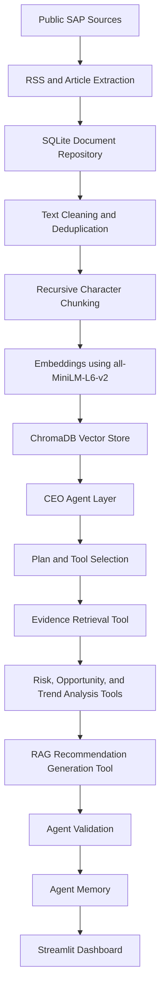
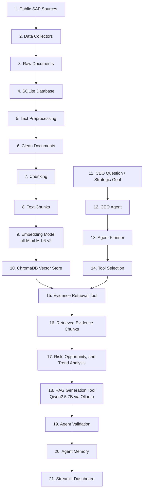

# SAP AI CEO Strategic Intelligence Agent

## Project Overview

This project is an NLP and Agentic Retrieval-Augmented Generation based Strategic Intelligence Agent for SAP.

The system collects public SAP-related information, stores it in a knowledge repository, retrieves relevant evidence, and uses a CEO Agent to create evidence-based strategic recommendations. The main goal is not only to summarize documents, but to convert collected information into useful business insights supported by evidence.

The system is designed to answer questions such as:

* What are the major opportunities for SAP?
* What are the biggest risks?
* What are competitors doing?
* Which technologies or trends should management monitor?
* What strategic action should SAP prioritize next?
* What evidence supports the recommendation?

---

## Selected Company

**Company:** SAP
**Industry:** Enterprise software, cloud ERP, Business AI, analytics, enterprise automation, and digital transformation.

Main focus areas:

* SAP Business AI
* Joule
* SAP BTP
* Cloud ERP
* RISE with SAP
* GROW with SAP
* Autonomous Enterprise
* Enterprise AI risks and opportunities

---

## Current Project Statistics

| Metric                |                 Value |
| --------------------- | --------------------: |
| Collected documents   |                   239 |
| Clean documents       |                   239 |
| Data sources          |                     6 |
| Text chunks           |                  3398 |
| Average quality score |                 90.15 |
| Database              |                SQLite |
| Vector store          |              ChromaDB |
| Embedding model       |      all-MiniLM-L6-v2 |
| Local LLM             | Qwen2.5:7B via Ollama |
| Embedding dimension   |                   384 |

---

## Data Sources

The system collects public information from multiple source types.

| Source Type               | Examples                                                         |
| ------------------------- | ---------------------------------------------------------------- |
| Official SAP sources      | SAP News Center, SAP technical topic feeds                       |
| Financial sources         | Financial news and press release feeds                           |
| External industry sources | TechTarget SearchSAP, TechTarget SearchERP, CIO Dive             |
| Technical sources         | SAP Business AI, cloud ERP, AI, and enterprise software articles |

This satisfies the project requirement of at least **100 collected documents** from at least **3 independent public sources**.

---

## System Architecture Diagram



---

## Data Flow Diagram



This data flow shows how public SAP-related information moves through the system. First, documents are collected and stored in SQLite. Then the text is cleaned, chunked, converted into embeddings, and indexed in ChromaDB. When a CEO-level question is asked, the CEO Agent creates a plan, selects tools, retrieves evidence, analyzes risk, opportunity, and trend signals, generates a recommendation using a local LLM, validates the output, stores the run in memory, and displays the full result in the Streamlit dashboard.

---

## AI Pipeline

### 1. Data Collection

The system automatically collects SAP-related public documents using RSS feeds and article extraction.

Collector files:

* `official_collector.py`
* `financial_collector.py`
* `technical_collector.py`
* `external_collector.py`

The collectors store the collected content into the SQLite database.

---

### 2. Knowledge Repository

SQLite is used as the main document repository.

Each document stores:

* title
* URL
* source name
* source type
* topic
* raw text
* cleaned text
* word count
* quality score
* published date
* collected timestamp

SQLite is mainly used for structured storage, metadata, dashboard tables, and human-readable article previews.

---

### 3. Preprocessing

The preprocessing step prepares raw web text for NLP processing.

Main cleaning steps:

* HTML tag removal
* web noise removal
* space normalization
* duplicate handling
* cleaned text update in SQLite

Files:

* `preprocess.py` — cleans newly collected documents
* `reclean_all_documents.py` — reapplies cleaning to all documents if the cleaning logic changes

---

### 4. Chunking

Clean documents are split into smaller chunks using recursive character chunking.

| Setting       | Value |
| ------------- | ----: |
| Chunk size    |   700 |
| Chunk overlap |   120 |

Chunking is used because full articles are too long for direct retrieval and LLM prompting. Smaller chunks help the system retrieve more focused evidence.

The overlap is used to avoid losing context between chunk boundaries.

---

### 5. Embeddings and Vector Store

Each chunk is converted into a semantic vector using:

```text
all-MiniLM-L6-v2
```

This model creates **384-dimensional embeddings**. Each text chunk becomes a 384-value vector.

The vectors are stored in ChromaDB. ChromaDB is used for semantic search during evidence retrieval.

---

### 6. Agentic Evidence Retrieval

When the user asks a CEO-level question, the CEO Agent receives it as a strategic goal.

The agent first creates a plan and selects the tools required for the goal. The retrieval tool then searches ChromaDB and returns relevant evidence chunks.

The retrieved evidence is used by the agent for:

* risk analysis
* opportunity analysis
* trend analysis
* CEO-level recommendation generation
* validation against evidence

---

### 7. CEO Agent Workflow

The CEO Agent follows this workflow:

```text
Goal → Plan → Tool Selection → Retrieve → Analyze → Recommend → Validate → Memory
```

Agent files:

* `planner.py` — detects the goal type and creates an execution plan
* `tools.py` — provides retrieval, risk, opportunity, trend, and recommendation tools
* `validator.py` — checks whether the output is supported and complete
* `memory.py` — stores previous agent runs
* `ceo_agent.py` — coordinates the complete agent workflow

The agent is responsible for controlling the process. RAG is used as one tool inside the agent, not as the entire system.

---

### 8. CEO Recommendation Generation

The retrieved evidence is passed to a local LLM through Ollama.

Current model:

```text
Qwen2.5:7B
```

The model is instructed to answer only using retrieved evidence. Each recommendation must include evidence IDs such as `chunk_6385`.

The system does not use OpenAI, Gemini, Claude, or any paid commercial LLM API as the main reasoning engine.

---

### 9. Agent Validation

After the recommendation is generated, the agent validates the output.

The validator checks:

* whether an answer exists
* whether retrieved evidence exists
* whether only valid evidence IDs are used
* whether the answer includes a recommendation
* whether risks are mentioned
* whether priority is mentioned
* whether confidence is mentioned

If validation passes, the dashboard marks the recommendation as approved by agent validation. If validation fails, the system shows the validation issues transparently instead of blindly approving the answer.

---

## Design Decisions

| Design Decision                            | Reason                                                                                                                 |
| ------------------------------------------ | ---------------------------------------------------------------------------------------------------------------------- |
| SAP was selected as the company            | SAP has strong public information around Business AI, cloud ERP, Joule, SAP BTP, and enterprise transformation.        |
| SQLite was used as the document repository | It is lightweight, local, easy to inspect, and suitable for an academic prototype.                                     |
| ChromaDB was used as the vector store      | It supports persistent local semantic search and works well with sentence embeddings.                                  |
| all-MiniLM-L6-v2 was used for embeddings   | It is lightweight, fast, free, and suitable for local semantic retrieval.                                              |
| Recursive character chunking was used      | It keeps chunks manageable while preserving useful context through overlap.                                            |
| Agentic RAG was used instead of only RAG   | The agent adds planning, tool selection, analysis, validation, and memory on top of evidence retrieval and generation. |
| Qwen2.5:7B through Ollama was used         | It is a freely accessible local LLM and produced more reliable structured recommendations than the smaller model.      |
| Streamlit was used for the dashboard       | It is simple to build, easy to demonstrate, and suitable for an interactive academic prototype.                        |
| VADER was used for sentiment analysis      | It provides a simple rule-based sentiment baseline for article and content tone.                                       |
| Evidence IDs were included in the output   | They make the recommendation explainable and allow claims to be traced back to retrieved chunks.                       |
| Agent validation was added                 | It prevents unsupported or incomplete recommendations from being approved automatically.                               |
| SQLite and ChromaDB were both used         | SQLite handles structured document storage, while ChromaDB handles semantic vector retrieval.                          |

---

## Technology Stack

| Component            | Tool / Library        |
| -------------------- | --------------------- |
| Programming language | Python                |
| Dashboard            | Streamlit             |
| Charts               | Plotly                |
| Database             | SQLite                |
| Vector store         | ChromaDB              |
| Embedding model      | all-MiniLM-L6-v2      |
| Embedding library    | SentenceTransformers  |
| LLM                  | Qwen2.5:7B via Ollama |
| LLM wrapper          | LangChain Ollama      |
| Agent logic          | Custom CEO Agent      |
| RAG logic            | Custom RAG pipeline   |
| Sentiment analysis   | VADER                 |
| Text cleaning        | BeautifulSoup, regex  |
| Data handling        | pandas                |

---

## Project Structure

```text
sap_ceo_intelligence_agent/
├── data/
│   └── agent_memory.jsonl
├── database/
│   └── intelligence.db
├── src/
│   ├── collectors/
│   │   ├── base_collector.py
│   │   ├── official_collector.py
│   │   ├── financial_collector.py
│   │   ├── technical_collector.py
│   │   └── external_collector.py
│   ├── dashboard/
│   │   ├── dashboard_utils.py
│   │   ├── company_overview_tab.py
│   │   ├── market_intelligence_tab.py
│   │   ├── opportunity_monitor_tab.py
│   │   ├── risk_monitor_tab.py
│   │   ├── sentiment_analysis_tab.py
│   │   ├── strategic_recommendations_tab.py
│   │   ├── ceo_briefing_tab.py
│   │   └── project_pipeline_tab.py
│   ├── pipeline/
│   │   ├── preprocess.py
│   │   ├── reclean_all_documents.py
│   │   ├── chunking.py
│   │   └── build_vector_store.py
│   ├── rag/
│   │   ├── prompts.py
│   │   ├── retrieval.py
│   │   └── rag_chain.py
│   ├── agent/
│   │   ├── __init__.py
│   │   ├── planner.py
│   │   ├── tools.py
│   │   ├── validator.py
│   │   ├── memory.py
│   │   └── ceo_agent.py
│   ├── config.py
│   ├── database.py
│   └── quality_checks.py
├── vector_store/
├── app.py
├── README.md
├── requirements.txt
└── .gitignore
```

---

## How to Run

### 1. Create virtual environment

```powershell
python -m venv .venv
```

### 2. Activate virtual environment

```powershell
.\.venv\Scripts\Activate.ps1
```

### 3. Install requirements

```powershell
python -m pip install -r requirements.txt
```

### 4. Pull the Ollama model

```powershell
ollama pull qwen2.5:7b
```

### 5. Initialize database

```powershell
python -m src.database
```

### 6. Collect documents

```powershell
python -m src.collectors.official_collector
python -m src.collectors.financial_collector
python -m src.collectors.technical_collector
python -m src.collectors.external_collector
```

### 7. Preprocess documents

```powershell
python -m src.pipeline.preprocess
```

If preprocessing logic is updated and all documents need to be cleaned again:

```powershell
python -m src.pipeline.reclean_all_documents
```

### 8. Create chunks

```powershell
python -m src.pipeline.chunking
```

### 9. Build vector store

```powershell
python -m src.pipeline.build_vector_store
```

### 10. Test CEO Agent

```powershell
python -m src.agent.ceo_agent
```

### 11. Run dashboard

```powershell
python -m streamlit run app.py --server.fileWatcherType none
```

---

## Evidence Control

The system includes prompt-level and agent-level controls to reduce hallucination:

* the LLM must use only retrieved evidence
* valid evidence IDs are passed into the prompt
* fake evidence IDs are not allowed
* every recommendation must cite evidence
* unsupported risks are restricted
* financial claims are blocked unless present in evidence
* the output includes evidence limitations
* the agent validates whether the answer uses valid evidence IDs
* the agent checks whether risk, priority, and confidence are included

---

## Limitations

This is an academic prototype, so it has some limitations:

* Public web sources may change over time.
* SAP official sources may naturally present SAP positively.
* Sentiment analysis shows article tone, not direct customer opinion.
* Risk and opportunity labels are based on heuristic logic.
* Local LLM generation is slower than paid cloud APIs.
* The system supports strategic analysis, but it is not a financial forecasting model.
* Generated recommendations still need human review before real business use.

---

## Future Improvements

Possible improvements:

* add more external competitor sources
* add hybrid retrieval using BM25 and embeddings
* improve risk classification using a trained model
* add source freshness weighting
* add PDF export for CEO briefings
* evaluate recommendations against human-labelled strategic relevance

---

## Final Summary

This project demonstrates a complete NLP and Agentic RAG-based Strategic Intelligence Agent for SAP. It collects public information, stores it in a structured repository, processes and embeds the text, retrieves relevant evidence, and uses a CEO Agent to plan the task, select tools, analyze strategic signals, generate CEO-level recommendations, validate them against evidence, and store the run in memory.

The final system is evidence-based, explainable, and aligned with the goal of transforming information into strategic decisions.
